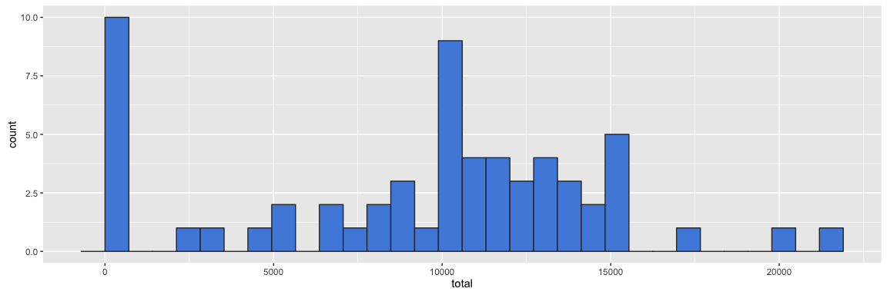
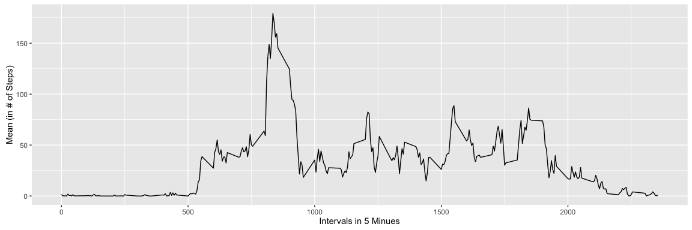
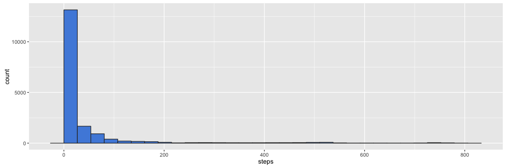
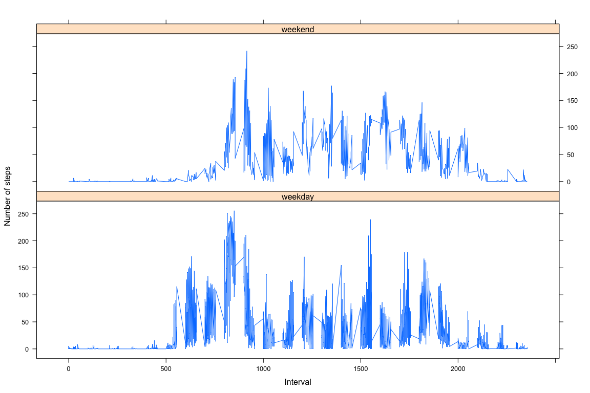

# Reproducible Research: Peer Assessment 1

### Reproducible Research / Herminio Vazquez

***
### Loading and preprocessing the data
Loading the data from the original location in the Coursera website and assigning it, to the data variable.

```r
temp <- tempfile()

# Remote location of file to be downloaded
download.file("https://d396qusza40orc.cloudfront.net/repdata%2Fdata%2Factivity.zip",temp)

# 1.1 Load Data
# Reading the csv data into the data variable
data <- read.csv(unz(temp, "activity.csv"))

# 1.2 Parse data
data_source <- tbl_df(data)
data <- data_source %>% replace(is.na(.), 0)

# Convert date column to date objects
data$date <- ymd(data$date)

# Compute the weekdays from the date attribute
data <- data.frame(date=data$date, 
                           weekday=tolower(weekdays(data$date)), 
                           steps=data$steps, 
                           interval=data$interval)

# Compute the day type (weekend or weekday)
data <- cbind(data, 
            daytype=ifelse(data$weekday == "saturday" | 
                      data$weekday == "sunday", "weekend", 
            "weekday"))

# Create the final data.frame
data <- data.frame(date=data$date, 
                       weekday=data$weekday, 
                       daytype=data$daytype, 
                       interval=data$interval,
                       steps=data$steps)


unlink(temp)
```

### What is mean total number of steps taken per day?
Perform some statistical computations for the steps

```r
# Calculate total number of steps per day
print(mean(data$steps, na.rm = TRUE))
```

```
## [1] 32.47996
```

Using dplyr package to create a filter pipeline that sums all steps grouping by the date column

```r
steps_per_day <- data %>% 
  group_by(date) %>% 
  summarise(total=sum(steps))
```

### What is mean total number of steps taken per day?

1. Calculate the total number of steps taken per day

```r
kable(steps_per_day)
```


date          total
-----------  ------
2012-10-01        0
2012-10-02      126
2012-10-03    11352
2012-10-04    12116
2012-10-05    13294
2012-10-06    15420
2012-10-07    11015
2012-10-08        0
2012-10-09    12811
2012-10-10     9900
2012-10-11    10304
2012-10-12    17382
2012-10-13    12426
2012-10-14    15098
2012-10-15    10139
2012-10-16    15084
2012-10-17    13452
2012-10-18    10056
2012-10-19    11829
2012-10-20    10395
2012-10-21     8821
2012-10-22    13460
2012-10-23     8918
2012-10-24     8355
2012-10-25     2492
2012-10-26     6778
2012-10-27    10119
2012-10-28    11458
2012-10-29     5018
2012-10-30     9819
2012-10-31    15414
2012-11-01        0
2012-11-02    10600
2012-11-03    10571
2012-11-04        0
2012-11-05    10439
2012-11-06     8334
2012-11-07    12883
2012-11-08     3219
2012-11-09        0
2012-11-10        0
2012-11-11    12608
2012-11-12    10765
2012-11-13     7336
2012-11-14        0
2012-11-15       41
2012-11-16     5441
2012-11-17    14339
2012-11-18    15110
2012-11-19     8841
2012-11-20     4472
2012-11-21    12787
2012-11-22    20427
2012-11-23    21194
2012-11-24    14478
2012-11-25    11834
2012-11-26    11162
2012-11-27    13646
2012-11-28    10183
2012-11-29     7047
2012-11-30        0


2. If you do not understand the difference between a histogram and a barplot, research the difference between them. Make a histogram of the total number of steps taken each day


```r
g <- ggplot(steps_per_day, aes(x=total))
g + geom_histogram(color="#333333", fill="#508cdd", bins = 30)
```

 

3. Calculate and report the mean and median of the total number of steps taken per day


```r
mean(steps_per_day$total)
```

```
## [1] 9354.23
```

```r
median(steps_per_day$total)
```

```
## [1] 10395
```

### What is the average daily activity pattern?

1. Make a time series plot (i.e. type = "l") of the 5-minute interval (x-axis) and the average number of steps taken, averaged across all days (y-axis)


```r
interval_plot <- aggregate(x=list(avg_steps=data$steps), by=list(interval=data$interval), FUN=mean, na.rm=TRUE)

ggplot(data=interval_plot, aes(x=interval, y=avg_steps)) +
    geom_line() +
    xlab("Intervals in 5 Minues") +
    ylab("Mean (in # of Steps)") 
```

 

2. Which 5-minute interval, on average across all the days in the dataset, contains the maximum number of steps?


```r
max_steps <- max(interval_plot$avg_steps)
interval_plot %>% filter(avg_steps >= max_steps) %>% select(interval)
```

```
##   interval
## 1      835
```

### Imputing missing values

1. Calculate and report the total number of missing values in the dataset (i.e. the total number of rows with NAs)

```r
sum(is.na(data_source$steps))
```

```
## [1] 2304
```

2. Devise a strategy for filling in all of the missing values in the dataset. The strategy does not need to be sophisticated. For example, you could use the mean/median for that day, or the mean for that 5-minute interval, etc.


```r
avg_steps_agg <- aggregate(steps ~ interval, data = data_source, FUN = mean)
fill_empty_values <- numeric()
for (i in 1:nrow(data_source)) {
    obs <- data_source[i, ]
    if (is.na(obs$steps)) {
        steps <- subset(avg_steps_agg, interval == obs$interval)$steps
    } else {
        steps <- obs$steps
    }
    fill_empty_values <- c(fill_empty_values, steps)
}
```

3. Create a new dataset that is equal to the original dataset but with the missing data filled in.

```r
fill_data_source <- data_source
fill_data_source$steps <- fill_empty_values
```

4. Make a histogram of the total number of steps taken each day and Calculate and report the mean and median total number of steps taken per day. Do these values differ from the estimates from the first part of the assignment? What is the impact of imputing missing data on the estimates of the total daily number of steps?


```r
g <- ggplot(fill_data_source, aes(x=steps))
g + geom_histogram(color="#333333", fill="#508cdd", bins = 30)
```

 

**The distribution appears to be concentrated in the first values**

### Are there differences in activity patterns between weekdays and weekends?

1. Create a new factor variable in the dataset with two levels – “weekday” and “weekend” indicating whether a given date is a weekday or weekend day.


```r
# Incorporated in the handling of the file
str(data)
```

```
## 'data.frame':	17568 obs. of  5 variables:
##  $ date    : POSIXct, format: "2012-10-01" "2012-10-01" ...
##  $ weekday : Factor w/ 7 levels "friday","monday",..: 2 2 2 2 2 2 2 2 2 2 ...
##  $ daytype : Factor w/ 2 levels "weekday","weekend": 1 1 1 1 1 1 1 1 1 1 ...
##  $ interval: int  0 5 10 15 20 25 30 35 40 45 ...
##  $ steps   : num  0 0 0 0 0 0 0 0 0 0 ...
```

2. Make a panel plot containing a time series plot (i.e. type = "l") of the 5- minute interval (x-axis) and the average number of steps taken, averaged across all weekday days or weekend days (y-axis).


```r
# Compute the average number of steps taken, averaged across all daytype variable
mean_data <- aggregate(data$steps, 
                       by=list(data$daytype, 
                               data$weekday, data$interval), mean)

# Rename the attributes
names(mean_data) <- c("daytype", "weekday", "interval", "mean")

# Compute the time serie plot
xyplot(mean ~ interval | daytype, mean_data, 
       type="l", 
       lwd=1, 
       xlab="Interval", 
       ylab="Number of steps", 
       layout=c(1,2))
```

 
